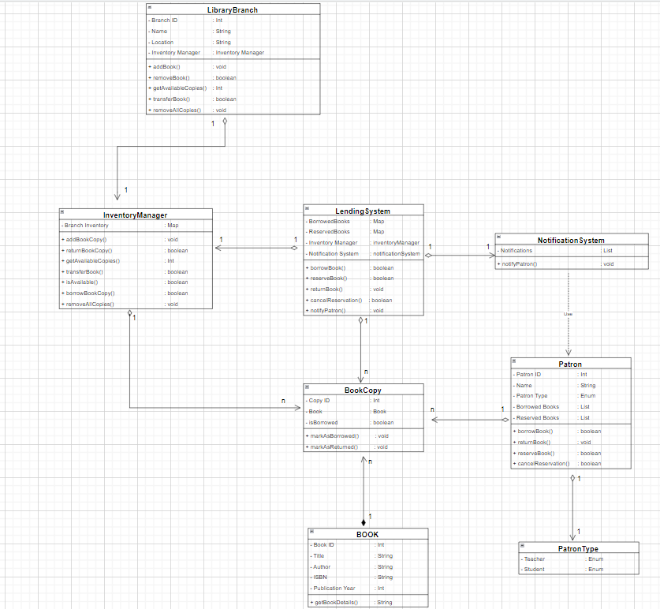

# AirTribe Assignment - Library Management System

## Overview

This Library Management System is a Java-based application designed to manage book inventory, lending, reservations, and notifications for library branches. It allows patrons to borrow, return, reserve, and cancel reservations for books, while also supporting book transfers between branches.

## Features

- **Book Inventory Management:** Add, remove, and transfer books between library branches.

- **Borrow & Return Books:** Patrons can borrow and return books with proper tracking.

- **Reservation System:** Allows patrons to reserve books when unavailable and cancel reservations.

- **Branch Support:** Each library branch maintains its own inventory.

- **Notifications:** Notifies patrons about book availability.


## Technologies Used

- **Java 20**
- **Object-Oriented Programming (OOP)**
- **SOLID Principles**
- **Design Patterns (Factory, Observer, Strategy)**
- **Java Collections Framework (List, Set, Map)**


## Prerequisties

- Java 15+
- IDE(STS, Eclipse, IntelliJ or VsCode)

## Note on Data Persistence 

The application uses List's and Set's(acts as in-memory database) for simplicity. In a real-world scenario, you would replace this with a proper database like MySQL or PostgreSQL.


## Project Structure

```bash
src
├── main
│   ├── Book                            # Contains all Book Related Data and Behaviour's
│   ├── BookCopy                        # Contains all BookCopy Related Data and Behaviour's
│   ├── Patron                          # Contains all Patron Related Data and Behaviour's
│   ├── PatronType                      # Contains all PatronType Related Data and Behaviour's
│   ├── InventoryManager                # Contains all Inventory Related Data and Behaviour's
│   ├── LibraryBranch                   # Contains all Library Branch Related Data and Behaviour's
│   ├── LendingSystem                   # Contains all Lending Related Data and Behaviour's
│   ├── NotificationSystem              # Contains all Notification Related Data and Behaviour's
│   ├── LibraryManagementSystem         # Contains all Library Management Testing Related Operation's
├── README.md

```


## UML Diagram

 
## Design Patterns Implemented in the Library Management System  

### 1. Factory Pattern  
   - Used for creating objects like `BookCopy` dynamically.
   - Instead of manually instantiating objects everywhere, a centralized method (addBookCopy) in InventoryManager handles the creation logic  
   - **Example:**  
     - The `InventoryManager` adds book copies dynamically when adding books to a branch, essentially acting as a factory for `BookCopy` objects. 

      `branchInventory.putIfAbsent(branchId, new HashMap<>());`
       `branchBooks.putIfAbsent(book, new ArrayList<>());`

            List<BookCopy> copiesList = branchBooks.get(book);
            for (int i = 0; i < copies; i++) {
                copiesList.add(new BookCopy(book)); // Creating unique BookCopy objects
            }  

### 2. Observer Pattern  
   - Implemented in the `NotificationSystem` to notify users when a book is available.  
   - When a book is returned, the system checks for reservations and notifies the next user in line.  
   - **Example:**  
     - `NotificationSystem` listens for events like book return and informs patrons who reserved it.  

### 3. Strategy Pattern  
   - Allows different strategies for borrowing and returning books without modifying core logic.  
   - **Example:**  
     - Reservation and lending rules are separate from inventory management, so `LendingSystem` can easily extend or change borrowing rules without modifying inventory logic.  
